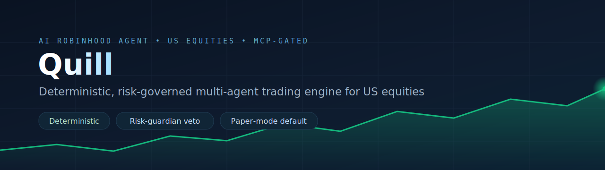
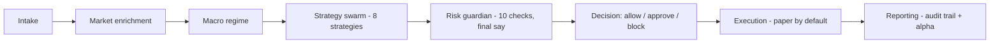
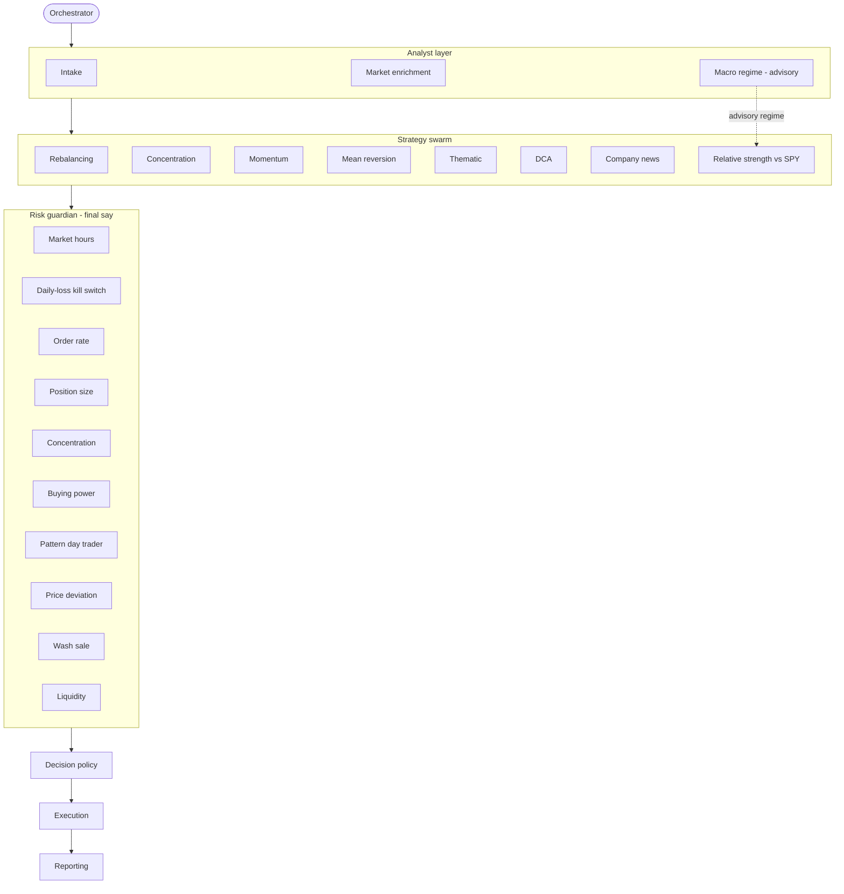
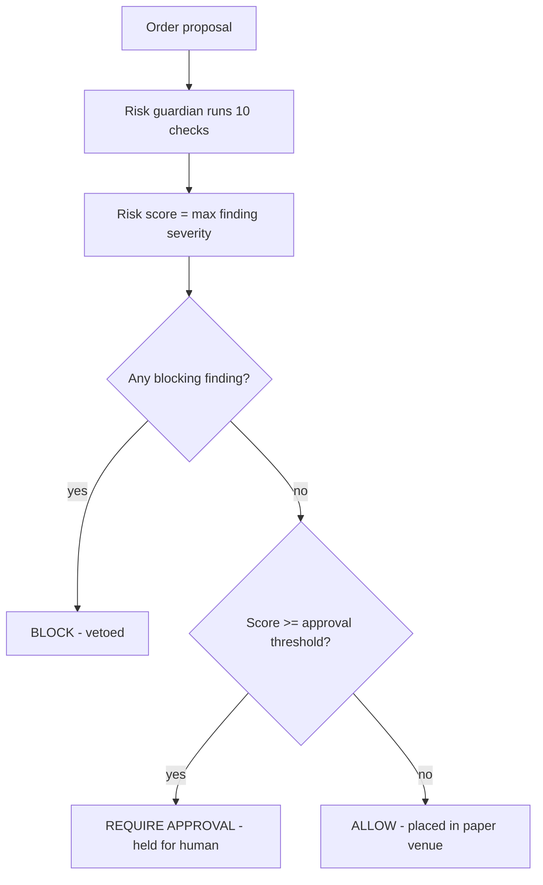
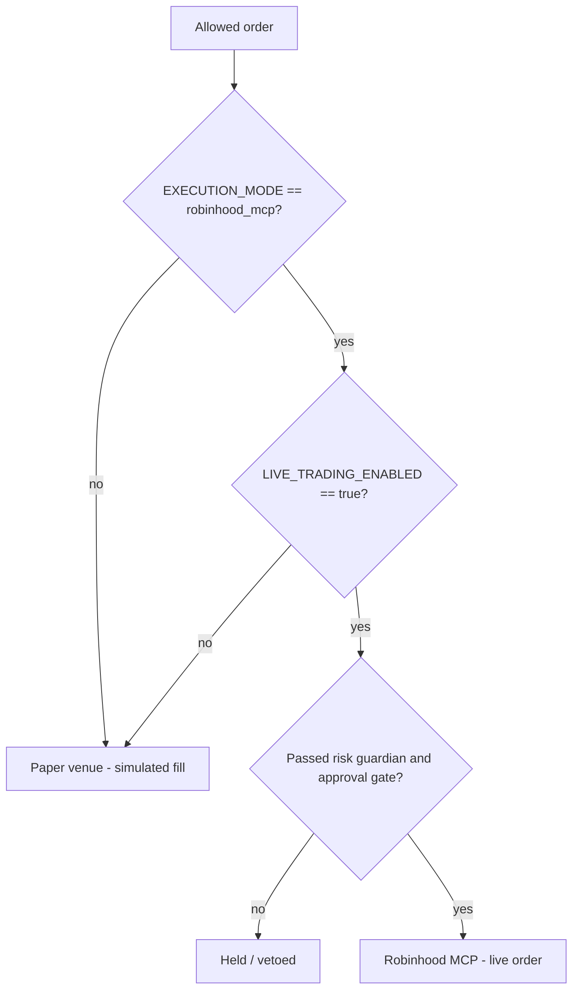

<p align="center">
  
</p>

# Quill &middot; AI Robinhood Agent

**A deterministic, risk-governed multi-agent trading engine for US equities.** A swarm
of strategy agents proposes orders, a deterministic macro-regime read frames the US
tape, and an independent **risk guardian has the final say** and can veto any order.
It runs in **paper (simulated) mode by default**; optional execution through
**Robinhood Agentic Trading (MCP)** is gated behind two explicit safety switches.

<p>


</p>

> This project is for research and education. It is **not investment, tax, or legal
> advice** and is **not affiliated with or endorsed by Robinhood**, any exchange, or
> any regulator. All bundled market data is synthetic. Robinhood discloses that it
> does not control, supervise, monitor, recommend, or audit third-party AI agents.
> Review `robinhood.com/us/en/support/agentic-trading` before enabling anything live.

## Contents

- [Highlights](#highlights)
- [Framework](#framework)
- [How it differs from LLM trading frameworks](#how-it-differs-from-llm-trading-frameworks)
- [Installation](#installation)
- [Required APIs and data sources](#required-apis-and-data-sources)
- [CLI usage](#cli-usage)
- [Markets and tickers](#markets-and-tickers)
- [Python usage](#python-usage)
- [Persistence and recovery](#persistence-and-recovery)
- [Reproducibility](#reproducibility)
- [Safety model](#safety-model)
- [Configuration](#configuration)
- [Develop](#develop)
- [Repository layout](#repository-layout)
- [References](#references)
- [License](#license)

## Highlights

- **US-market aware.** SPY-relative strength and a one-day alpha estimate, a
  deterministic macro-regime classifier (VIX, the 10Y-2Y curve, the SPY trend), an
  NYSE/Nasdaq market-hours gate, the FINRA pattern-day-trader limit, T+1 buying-power
  buffering, and an IRS 30-day wash-sale guard.
- **Agent-swarm architecture.** An orchestrator coordinates an analyst layer, an
  eight-strategy swarm, a ten-check risk guardian, decisioning, execution, and
  reporting. Each strategy and each check runs in isolation so one failure cannot take
  down the run.
- **Deterministic by design.** Unlike LLM-driven trading frameworks, scoring and
  decisions are reproducible. A language model may enrich the narrative only — it never
  changes a score or a decision.
- **The risk guardian has final say.** A blocking finding vetoes an order regardless of
  any strategy's conviction.
- **Safe by default.** Paper mode, synthetic data, gated live execution, and an
  optional advisory collective memory that is off by default.

## Framework

The engine mirrors the desks of a small trading firm, but every stage is deterministic.



Under the hood, an orchestrator owns the run and fans work out to two swarms. Every
strategy and every risk check runs in isolation, so one failure degrades a single
signal instead of the whole run.



### Analyst layer

- **Intake** validates the account, positions, goals, and the market snapshot.
- **Market enrichment** derives portfolio weights and a deterministic news-sentiment
  summary per target name.
- **Macro regime** classifies the US tape as risk-on, neutral, or risk-off from VIX,
  the 10Y-2Y Treasury spread, and the SPY trend. The regime is advisory and never
  changes a decision. See [skills/macro-regime/SKILL.md](skills/macro-regime/SKILL.md).

### Strategy swarm

Eight independent strategies propose orders: rebalancing, concentration, momentum,
mean reversion, thematic, dollar-cost averaging, company news, and **relative strength
versus SPY**. See [references/strategy-playbook.md](references/strategy-playbook.md).

### Risk guardian (final say)

Ten deterministic checks bound every order: market hours, daily-loss kill switch,
order rate, order-notional / position size, sector concentration, buying power,
pattern-day-trader limit, limit-price deviation, **wash sale**, and liquidity. Blocking
findings veto the order. See [references/risk-limits.md](references/risk-limits.md) and
[references/us-market-conventions.md](references/us-market-conventions.md).

### Trader, decision, and reporting

- **Decision** maps findings to `allow`, `require_approval`, or `block`.
- **Execution** places only allowed orders (paper by default).
- **Reporting** emits an audit-ready report with a per-order reasoning trail, the
  market regime, and a deterministic one-day alpha versus SPY.

## How it differs from LLM trading frameworks

| Dimension | Typical LLM trading agent | AI Robinhood Agent |
| --- | --- | --- |
| Scoring & decisions | LLM-driven, non-deterministic | Deterministic and reproducible |
| Role of the LLM | Makes the call | Narrative enrichment only |
| Final authority | A trader/portfolio LLM | An independent, rule-based risk guardian |
| Default data | Live feeds | Synthetic snapshot (offline) |
| Default execution | Often live or backtest | Paper mode; live is double-gated |

## Installation

```bash
python -m pip install -e ".[dev]"
```

The console script `robinhood-agent` is installed. If it is not on your PATH, use
`python -m robinhood_agent.cli` instead.

## Required APIs and data sources

None are required for the default offline engine — every quote, bar, news item, and
macro indicator is part of the run snapshot. Live US data and execution are optional,
gated stubs that read credentials from the environment only:

| Capability | Provider | Environment |
| --- | --- | --- |
| Market data | Yahoo Finance, Alpha Vantage, Polygon.io | `MARKET_DATA_PROVIDER=live`, `MARKET_DATA_API_KEY` |
| Macro series | FRED, CBOE (VIX) | fed into `snapshot.macro` |
| Company news | vendor news API | `NEWS_PROVIDER=live`, `NEWS_API_KEY` |
| Narrative LLM | OpenAI-compatible | `OPENAI_API_KEY` (extra `llm`) |
| Execution | Robinhood Agentic Trading (MCP) | `EXECUTION_MODE=robinhood_mcp`, `LIVE_TRADING_ENABLED=true` |

See [references/us-market-data-sources.md](references/us-market-data-sources.md) and
[.env.example](.env.example).

## CLI usage

```bash
# Paper run over the bundled synthetic sample; writes a JSON report to output/
python -m robinhood_agent.cli run data/samples/sample_run.json --output output

# Full JSON report (reasoning trail, regime, and alpha) for one run
python -m robinhood_agent.cli explain data/samples/sample_run.json
```

Decision outcomes:

| Outcome | Meaning |
| --- | --- |
| ALLOW | Within all limits; placed (paper). |
| REQUIRE APPROVAL | Advisory risk at or above the approval threshold; held for a human. |
| BLOCK | A blocking limit was breached; vetoed by the risk guardian. |

Each proposal takes the maximum severity across its risk findings and maps to one
outcome. A blocking finding always wins, regardless of any strategy's conviction.



The sample run yields a mix of all three (for example a tech buy blocked by
concentration, an illiquid name held for approval, a wash-sale repurchase routed to
review, and in-limit orders allowed).

## Markets and tickers

US equities, with **SPY** as the default benchmark for relative strength and the
one-day alpha estimate. Override per run with `goals.benchmark`, or globally with
`config.benchmark.symbol` / `BENCHMARK_SYMBOL`. The Robinhood Agentic Trading beta is
equities only.

## Python usage

```python
from robinhood_agent.pipeline import TradingPipeline, load_run_from_json

pipeline = TradingPipeline()                      # offline, paper, deterministic
run_input = load_run_from_json("data/samples/sample_run.json")
result = pipeline.run(run_input)

print(result.report["counts"])                    # outcome counts
print(result.report["benchmark"])                 # SPY day change, alpha estimate
print(result.report["market_regime"]["regime"])   # risk_on | neutral | risk_off
```

## Persistence and recovery

Collective memory is optional and **off by default**. When enabled it records each
decision to a local SQLite store, recalls prior same-symbol history as advisory
context on later runs, accepts analyst feedback labels, and can suggest an approval
threshold. Recall, feedback, and calibration are all deterministic and never override
the risk guardian. See [references/memory-and-learning.md](references/memory-and-learning.md).

```bash
python -m robinhood_agent.cli run data/samples/sample_run.json -m .agent_memory/memory.db
python -m robinhood_agent.cli feedback <proposal_id> good_trade -m .agent_memory/memory.db
python -m robinhood_agent.cli calibrate -m .agent_memory/memory.db
```

## Reproducibility

The engine is deterministic: the same run input produces the same scores and the same
decisions, every time. The optional LLM affects only the narrative summary, never a
score or a decision. To keep a run reproducible, pin the snapshot (the offline
default) rather than pulling live data that moves between runs. Determinism is enforced
by a test that asserts identical outcome counts across repeated runs.

## Safety model

Live trading requires **both** switches; either missing forces paper:

- `EXECUTION_MODE=robinhood_mcp`
- `LIVE_TRADING_ENABLED=true`



Even then, every order still passes the risk guardian, the decision policy, and any
human-approval gate. See [references/execution-and-safety.md](references/execution-and-safety.md)
and [references/robinhood-mcp-integration.md](references/robinhood-mcp-integration.md).

## Configuration

All thresholds live in [config/config.yaml](config/config.yaml) — benchmark, macro
thresholds, strategy toggles, and every risk limit. A subset can be overridden by
environment variables; see [.env.example](.env.example). Nothing is hardcoded in logic.

## Develop

Run the same quality gates as CI — skill validation, linting, type-checking, and tests:

```bash
python scripts/validate_skills.py
python -m ruff check src/robinhood_agent tests
python -m mypy src/robinhood_agent
python -m pytest -q
```

## Repository layout

- `skills/` — one Agent Skill per folder, each with a `SKILL.md`.
- `agents/` — specialist personas (strategist, risk officer, execution trader).
- `references/` — strategy playbook, risk limits, US conventions, US data sources,
  safety, MCP integration, memory.
- `src/robinhood_agent/` — the executable engine the skills describe.
- `data/samples/` — synthetic sample run input.

## References

- [US market conventions](references/us-market-conventions.md) — sessions, PDT, T+1, wash sale.
- [US market data sources](references/us-market-data-sources.md) — Yahoo, Alpha Vantage, Polygon, FRED, SEC EDGAR.
- [Strategy playbook](references/strategy-playbook.md) and [Risk limits](references/risk-limits.md).
- [Execution and safety](references/execution-and-safety.md) and [Robinhood MCP integration](references/robinhood-mcp-integration.md).

## License

MIT. See [LICENSE](LICENSE).
